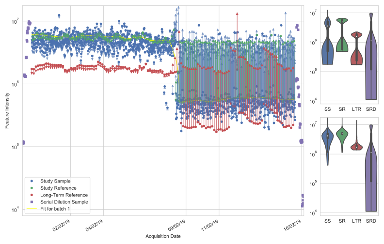

Batch *&* Run-Order Correction
------------------------------

The :py:mod:`~nPYc.batchAndROCorrection` module provides tools to detect and correct for per-feature run-order and batch effects in :py:class:`~nPYc.objects.MSDataset`, by characterising the effect in reference samples and interpolating a correction factor to the intermediate samples.

.. figure:: _static/plotBatchAndROCorrection.svg
	:figwidth: 70%
	:alt: Samples with run-order and batch correction applied
	
	Samples pre and post run-order and batch correction, plus the fit applied to a dataset.

Run-order and batch correction may be applied following an adapted version of the LOWESS approach proposed by Dunn *et al* [#]_.

In brief, for each MS feature, a LOWESS estimator is fitted on the series of consecutive :term:`Study Reference` samples for each analytical batch (which can be defined by the user, see :doc:`Sample Metadata<../samplemetadata>`). The value for that feature in each sample is corrected by dividing the original intensity value by the interpolated value of the LOWESS curve at its position in the run order (final intensity units are a ratio to intensity in the ”mean” *Study Reference* sample expressed by the LOWESS curve). The window of the LOWESS smoother can be set by the user (default value=11), care should be taken not to over-fit the run-order correction. Batch diverences are corrected by aligning median feature intensities in the *Study Reference* samples between batches.

Batch *&* Run-Order Correction Assessment
=========================================

Batch *&* run-order correction performance can be assessed on a subset of features prior to running on the whole dataset using the *Batch Correction Assessment* report::
	
	nPYc.reports.generateReport(msData, 'batch correction assessment', batch_correction_window=11)

This report shows the LOWESS fit for a number of features (default 10), and the results of applying such a fit.

	
	Example outcome of applying batch and run-order correction to one feature, plot shows sample intensities before and after run-order and batch correction, plus the LOWESS fit.
	
By comparing the results across all surveyed features, the parameters for and necessity of correction can be assessed:

- Is the window of the LOWESS smoother appropriate? Check that only broad and not narrow trends are being fitted, change batch_correction_window parameter if required.
- Does the correction need to be applied in different sub-batches? Check if there is a common and consistant jump in intensity across all features, amend the sample batches if required.
- Is batch correction required? Check if there is an observable trend in the batch and/or run-order, if not then correction is not required!

Once these questions have been assessed, the appropriate parameters can be modified, or samples excluded, for full details and a worked example see the LC-MS tutorial at :doc:`tutorial`.

After running correction, the results can be assessed using the *Batch Correction Summary* report::

	nPYc.reports.generateReport(dataset, 'batch correction summary', msDataCorrected=datasetCorrected)

Running Batch *&* Run-Order Correction
======================================

Batch and run-order correction can be applied to a :py:class:`~nPYc.objects.MSDataset` using::
	
	datasetCorrected = nPYc.batchAndROCorrection.correctMSdataset(dataset, window=11)

.. automodule:: nPYc.batchAndROCorrection
   :members:

.. [#] Warwick B Dunn, David Broadhurst, Paul Begley, Eva Zelena, Sue Francis-McIntyre, Nadine Anderson, Marie Brown, Joshau D Knowles, Antony Halsall, John N Haselden, Andrew W Nicholls, Ian D Wilson, Douglas B Kell, Royston Goodacre, and The Human Serum Metabolome (HUSERMET) Consortium. Procedures for large-scale metabolic profiling of serum and plasma using gas chromatography and liquid chromatography coupled to mass spectrometry. Nature Protocols, 6:1060 EP –, 06 2011. URL: http://dx.doi.org/10.1038/nprot.2011.335.