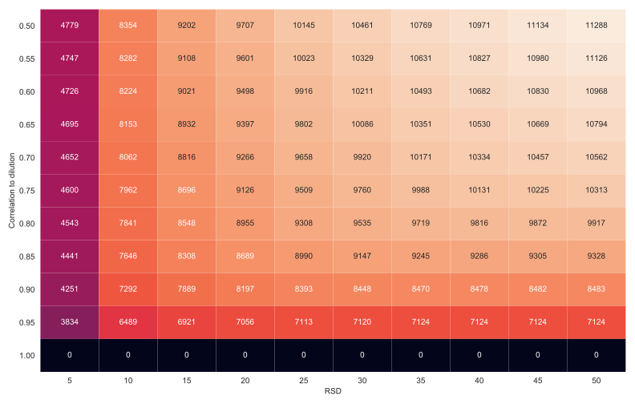

Feature Filtering
-----------------

Feature filtering describes the removal of certain low-quality or uninformative features from the dataset. How and which features are removed is method specific, and described briefly here. More details with examples are given in the :doc:`tutorial`

Feature Filtering in NMR Datasets
=================================

For NMR datasets, feature filtering typically takes the form of removing one or more sections of the spectra known to contain unwanted or un-informative signals.

The regions typically removed are pre-defined in the :doc:`Configuration Files<configuration/builtinSOPs>`, and can be automatically flagged for removal, and subsequently removed using::

	dataset.updateMasks(filterSamples=False, filterFeatures=True)
	dataset.applyMasks()
	
For more details on using :py:meth:`~nPYc.objects.Dataset.updateMasks` see :doc:`Sample and Feature Masks<objects>`.

Feature Filtering in LC-MS Dataset
==================================

For LC-MS datasets, features should be filtered based on their individual precision and accuracy (Lewis *et al* [#]_) in the nPYc-Toolbox the default parameters for feature filtering are as follows:

.. table:: LC-MS Feature Filtering Criteria
   :widths: auto
   
   ========================================== ================================================ =================== =====================
   Criteria                                   In                                               Default Value       Assesses
   ========================================== ================================================ =================== =====================
   Correlation to dilution                    :term:`Serial Dilution Sample`                   > 0.7               Intensity responds to changes in abundance (accuracy)
   :term:`Relative Standard Deviation` (RSD)  :term:`Study Reference`                          < 30                Analytical stability (precision)
   RSD in SS * *default value* > RSD in SR    :term:`Study Sample` and :term:`Study Reference` 1.1                 Variation in SS should always be greater than variation in SR
   ========================================== ================================================ =================== =====================
   
The distribution of correlation to dilution, and RSD can be visualised in the *Feature Summary Report* (see :doc:`reports>` for more details).

A report summarising number of features passing selection with different criteria can also be produced using::

	nPYc.reports.generateReport(dataset, 'feature selection')
	
This generates a list of the number of features passing each filtering criteria, alongside a heatmap showing the number of features resulting from applying different RSD and correlation to dilution thresholds.

	
	Heatmap of the number of features passing selection with different Residual Standard Deviation (RSD) and correlation to dilution thresholds

Criteria can be modified if required, for example for the RSD threshold using::

	dataset.Attributes['rsdThreshold'] = 20
	
Features failing selection can be automatically flagged for removal, and subsequently removed (as above) using::

	dataset.updateMasks(filterSamples=False, filterFeatures=True)
	dataset.applyMasks()
	
	
.. [#] Matthew R Lewis, Jake TM Pearce, Konstantina Spagou, Martin Green, Anthony C Dona, Ada HY Yuen, Mark David, David J Berry, Katie Chappell, Verena Horneffer-van der Sluis, Rachel Shaw, Simon Lovestone, Paul Elliott, John Shockcor, John C Lindon, Olivier Cloarec, Zoltan Takats, Elaine Holmes and Jeremy K Nicholson. Development and Application of Ultra-Performance Liquid Chromatography-TOF MS for Precision Large Scale Urinary Metabolic Phenotyping. Analytical Chemistry, 88(18):9004-9013, 2016. URL: http://dx.doi.org/10.1021/acs.analchem.6b01481