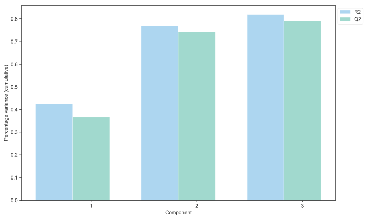
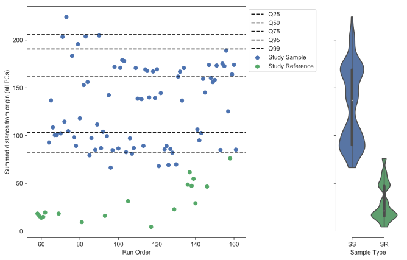
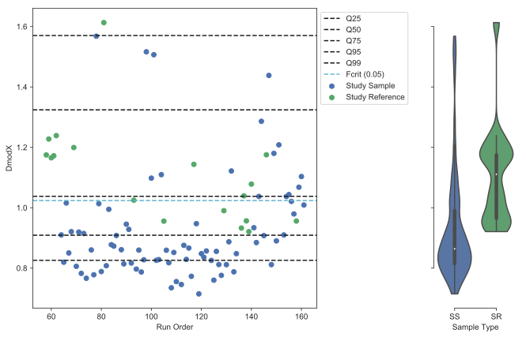
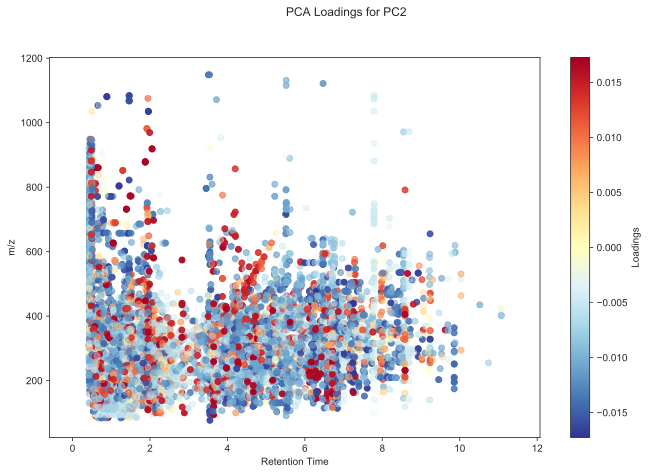
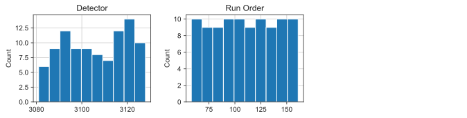
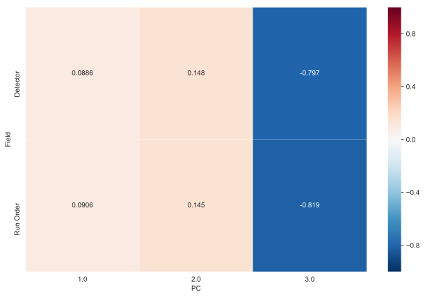
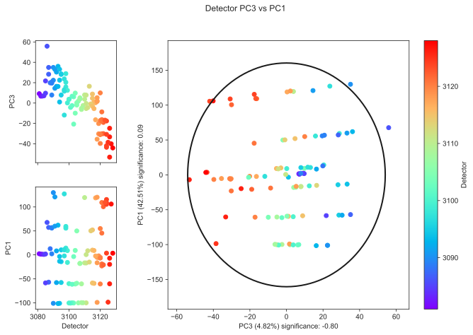

Multivariate Analysis
---------------------

The nPYc-Toolbox provides the capacity to generate a PCA model of the data (via the pyChemometrics module), and subesquently, to use this to assess data quality, identify potential sample and feature outliers, and determine any potential analytical associations with the main sources of variance in the data.

PCA Model
=========

A PCA model can be generated using :py:meth:`~nPYc.multivariate.exploratoryAnalysisPCA`::

	PCAmodel = nPYc.multivariate.exploratoryAnalysisPCA(dataset, scaling=1)
	
There are a number of parameters which can be optimised depending on the dataset.

One key paramter is 'scaling', which divides each column in the data matrix by its respective standard deviation raised to a power of the scaling parameter. This parameter can range in value between 0 and 1, and recommended values are 0 for mean centering only, 0.5 for Pareto scaling and 1 for unit variance (UV) scaling. The outcome of PCA model will vary based on the scaling method selected, and different scaling functions can be appropriate depending on the data itself and the question being asked of the data, see `van der Berg et al. 2006 <https://www.ncbi.nlm.nih.gov/pubmed/16762068>`_

The default scaling is unit variance (*scaling=1*), which scales every variable to have a variance of one, and thus all variables (despite their different magnitudes) become equally important in the model. For NMR, when smaller variables are more likely to be background noise, it may be that means-centering the data only (*scaling=0*) can be appropriate.

Each model is cross-validated using 7-fold cross-validation and the recommended number of principal components automatically estimated based on two criteria, when either one of these is met no more components will be added and the PCA model will be returned. There criteria are:

- *minQ2*: Q2 is the variance predicted by each component (from cross-validation), when adding a component does not improve Q2 by at least this value (default *minQ2=0.05*) then no more components will be added.
- *maxComponents*: this defines the maximum number of components (default *maxComponents=10*) returned by the model (regardless of Q2 increases).

The main function parameters are as follows:

.. automodule:: nPYc.multivariate.exploratoryAnalysisPCA
   :members:

Multivariate Analysis Report
============================

The analytical multivariate report provides visualisations summarising the largest sources of variance in the dataset (from a PCA model) with particular emphasis on any potential analytical sources, and can be generated using :py:meth:`~nPYc.reports.multivariateReport`::

	nPYc.reports.multivariateReport(dataset, PCAmodel)
 
These consist of:

- Scree plot of variance (Figure 1)
- Scores plots coloured by sample type (Figure 2)
- Strong sample outliers (Figure 3)
- DmodX sample outliers (Figure 4)
- Loadings plots (Figure 5)
- Distribution of analytical parameters (Figure 6)
- Heatmap of potential associations between analytical parameters and the main sources of variance (Figures 7 and 8)
- Scores plots coloured by analytical parameters with potential association (Figures 9-11)

The following sections describe these in more detail:

**Scree plot of variance**

The scree plot (Figure 1) shows the percentage of variance (cumulative) both explained (R2) and predicted (Q2) by each principal component in the model.

	
	Figure 1. PCA scree plot of variance explained by each component (cumulative).

This information can help to guide interpretation of the subsequent plots, for example, if separation is seen between QC samples in a given component, this would be much more serious if this component explained 50% of the variance than if the component only explained 3% of the variance.

If the variance is not predictable (negative or low Q2) this indicates that the model is not robust to different subsets of samples being are removed. This could be for a number of reasons, but it implies that there are likely no key analytical sources of variance, as these would inherently contribute throughout the run. 

**Scores plots coloured by sample type**

The PCA scores represent the new location of the samples in each pricipal component. A typical way to look at these is to plot the scores values in two dimensions, corresponding to pairs of components. Each point in a scores plot therefore represents a sample, with samples close together being more similar to each other, and those further apart being more dissimilar. By colouring by sample type (Figure 2), we can check, firstly, the consistency of the QC samples (SR and LTR) i.e. that they are tightly clustered; and secondly, for the presence of any sample outliers (any samples which are very different to the others).

.. figure:: _static/multivariate_Fig2_scoresPlotBySampleType.svg
	:figwidth: 70%
	:alt: Figure 2. PCA scores plots coloured by sample type.
	
	Figure 2. PCA scores plots coloured by sample type.

Outlying study samples in this plot are of interest (does this relate to biology, sample collection etc), but not of particular concern. However, any QC samples with unusual behaviour, or unusual clustering within QC samples, should be checked. Further sections of the multivariate report can help to elucidate if this behaviour may result from an analytical source (see below).

**Strong sample outliers**

Strong sample outliers are those which are very different from the others, these are seen as far outside the Hotelling's T ellipse (Figure 2) and with high values when you sum the total distance from origin across all components (Figure 3), these samples have high leverage and skew the model with their contribution to variance.

	
	Figure 3. Distribution in total distance from origin (scores space) by sample type.

Outliers in study samples are common, owing for example, to the presence of strong drug or dietary related signals. If LTR samples are strong outliers this is not a concern, as they may have a significanly different composition to the study samples, similarly SR samples may be overly weighted with very high concentration metabolites in one or more study sample, so may also be located away from the origin.

It would be expected here for all LTR and all SR samples to have roughly the same total distance from origin (although the two groups may be different from each other), as above, any deviation from this should be investigated.

**DmodX sample outliers**

DmodX (also called distance to model) is a measure of how well each sample fits the model itself. Unlike the strong sample outliers, outliers in DmodX (Figure 4) do not skew the model, but are simply not well represented by the model.

	
	Figure 4. Distribution in distance from model (DmodX) by sample type.

The interpretation of the DmodX plot is exactly as for the strong sample outliers though, with any deviation from a consistant value for all SR or LTR samples worthy of further investigation.

**Loadings plots**

The PCA loadings represent the weight of each original feature in forming the new PCA variables (scores). Thus there is a set of loadings (with values corresponding to each original feature) for each component in the model. The loadings can be plotted as for the scores, in pairs, however for improved interpretation here the loadings are plotted for each component separately. For NMR data, this takes the form of a standard (the median) spectrum, with each point coloured by it's relative contribution to that particular component (Figure 5A), and for LC-MS data an ion map similarly coloured by the model loadings (Figure 5B).

.. figure:: _static/multivariate_Fig5A_NMRloadings.svg
	:figwidth: 70%
	:alt: Figure 5A. PCA loadings (NMR).
	
	Figure 5A. PCA loadings (NMR).
	

	
	Figure 5B. PCA loadings (LC-MS).

These plots are useful in showing the regions of the spectrum with the most variance, and, by comparison with the scores plots (Figures 2 and 9-11) useful in determining any relationship to analytical sources (for example, variance in QC samples or association with specific analytical parameters).

**Distributions of analytical parameters**

Distributions of the sample metadata (in this case relating to recorded analytical parameters) are plotted in Figure 6 (in this example for the DEVSET LC-MS dataset).

	
	Figure 6. Histograms of metadata distributions (plotted for fields with non-uniform values only).

This allows the user to check if the behaviour of each parameter is as expected.

**Heatmap of potential associations between analytical parameters and the main sources of variance**

Potential associations between the principal components and any analytical parameters is tested by calculating either the correlation (for continuous data) or a Kruskal-Wallis test (for categorical data) between each parameter and the PCA scores for each component. The returned values are displayed in Figures 7 and 8, for continuous and categorical data respectively.

	
	Figure 7. Heatmap of correlation to PCA scores for suitable metadata fields.

These allow a quick assessment of whether any of the largest sources of variance in a dataset may have anayltical sources. By default, any significant associations (correlation > 0.3 or Kruskal-Wallis p-value < 0.05) are plotted (see below), these default values can be amended by setting the "r_threshold" or "kw_threshold" when calling 'multivariateReport'.

**Scores plots coloured by analytical parameters with potential association**

Additionaly for any fields where the correlation or p-value (respectively) exceed the threshold (default thresholds *r_threshold=0.3*, *kw_threshold=0.05*) the PCA scores plots are generated with sample points coloured according to their values for the flagged analytical parameter (in this case *Run Order*):

	
	Figure 9. PCA scores plots coloured by metadata (significance by correlation).
		
This allows quick identification and assessment of any analytical or pre-processing issues, and the subsequent action required depends on the analytical parameter flagged, for example, in this case batch and run-order correction would need to be applied, as there is a strong association with run order in PC3.

The main function parameters are as follows:

.. autoclass:: nPYc.reports.multivariateReport
  :members:

Interactive Plots
=================

Scores and loadings from a *PCAmodel* can also be explored interactively with the :py:meth:`~nPYc.plotting.plotScoresInteractive` and :py:meth:`~nPYc.plotting.plotLoadingsInteractive` functions. 

For example, a scores plot for components 1 and 2, with sample points coloured by *Run Order* can be generated using::

	data = nPYc.plotting.plotScoresInteractive(dataset, PCAmodel, 'Run Order', components=[1, 2])
	iplot(data)
	
Similarly a loadings plot for component 2 can be generated using::
	
	data = nPYc.plotting.plotLoadingsInteractive(dataset, PCAmodel, component=2)
	iplot(data)
	
Again, see the :doc:`Plot Gallery<plotsGallery>` for examples.

