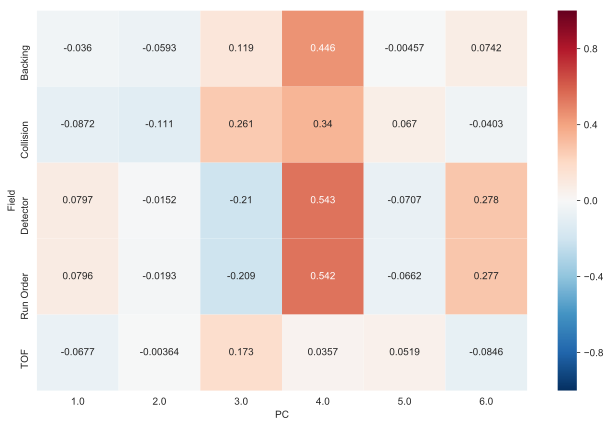
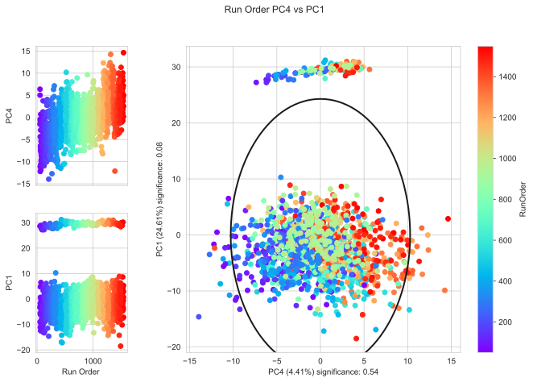

Multivariate Analysis
---------------------

The nPYc-Toolbox provides the capacity to generate a PCA model of the data (via the pyChemometrics module), and subesquently, to use this to assess data quality, identify potential sample and feature outliers, and determine any potential analytical associations with the main sources of variance in the data.

Details are given here, and worked examples in the :doc:`tutorial`.

PCA Model
=========

A PCA model can be generated using :py:meth:`~nPYc.multivariate.exploratoryAnalysisPCA`::

	PCAmodel = nPYc.multivariate.exploratoryAnalysisPCA(dataset, scaling=1)
	
The default scaling is unit variance (*scaling=1*), and the number of components is determined based on a minimum increase in Q2Y (*minQ2=0.05*) up until a maximum number of components has been reached (*maxComponents=10*), for full documentation see :py:meth:`~nPYc.multivariate.exploratoryAnalysisPCA`

.. automodule:: nPYc.multivariate.exploratoryAnalysisPCA
   :members:

Multivariate Analysis Report
============================

The analytical multivariate report provides visualisations summarising the largest sources of variance in the dataset (from a PCA model) with particular emphasis on any potential analytical sources, and can be generated using :py:meth:`~nPYc.reports.multivariateReport`::

	nPYc.reports.multivariateReport(dataset, PCAmodel)
 
The main standard PCA plots include:

 - Model statistics (distance from model, distance from origin): useful to assess the presence of potential sample outliers
 - Scores plots: provide insight into the relationship between samples, for example, consistency of the :term:`Study Reference` samples, presence of sample outliers etc.
 - Loadings plots: provides insight into the features with the largest variance in the dataset.
 
For examples, see the :doc:`Plot Gallery<plotsGallery>`

In addition, and perhaps of most interest with respect to quality control, is the functionality to assess potential associations between the largest sources of variance in the dataset (from the PCA scores) and the analytical parameters (for importing these parameters to the Dataset see :doc:`samplemetadata`).

During generation of the report, the correlation (for continuous metadata) or a Kruskal-Wallis test (for categorical metadata) is calculated between each metadata field and each set of PCA scores, and association values plotted in a heatmap:

	
	Heatmap of correlation coefficients between PCA scores and analytical parameters with continuous values 

Additionaly for any fields where the correlation or p-value (respectively) exceed the threshold (default thresholds *r_threshold=0.3*, *kw_threshold=0.05*) the PCA scores plots are generated with sample points coloured according to their values for the flagged analytical parameter (in this case *Run Order*):

	
	PCA scores plot with sample points coloured by corresponding values for the analytical parameter run order 

This allows quick identification and assessment of any analytical or pre-processing issues, for example, in this case batch and run-order correction would need to be applied!

For full details of the multivariateReport function see :py:meth:`~nPYc.reports.multivariateReport`

.. autoclass:: nPYc.reports.multivariateReport
  :members:

Interactive Plots
=================

Scores and loadings from a *PCAmodel* can also be explored interactively with the :py:meth:`~nPYc.plotting.plotScoresInteractive` and :py:meth:`~nPYc.plotting.plotLoadingsInteractive` functions. 

For example, a scores plot with sample points coloured by *Run Order* can be generated using::

	data = nPYc.plotting.plotScoresInteractive(dataset, PCAmodel, 'Class', components=[1, 2])
	iplot(data)
	
Similarly a loadings plot for component 2 can be generated using::
	
	data = nPYc.plotting.plotLoadingsInteractive(dataset, PCAmodel, component=2)
	iplot(data)
	
Again, see the :doc:`Plot Gallery<plotsGallery>` for examples.

