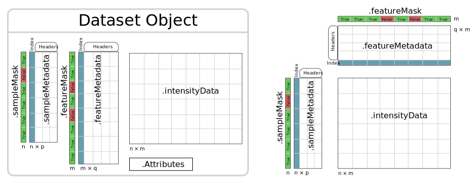

nPYc-Toolbox Dataset Objects
----------------------------

Dataset classes
===============

The nPYc toolbox is built around a core :py:class:`~nPYc.objects.Dataset` class, that represents a collection of measurements, with biological and analytical metadata associated with each sample, and analytical and chemical metadata associated with the observations.

Instances of the Dataset class and its subclasses are capable of instantiating themselves from common data types, including certain raw data formats, common interchange formats, and the outputs of popular data-processing tools.

The Dataset family of class include methods for mapping additional metadata into the object (see :py:meth:`~nPYc.objects.Dataset.addSampleInfo`), as well exporting a representation of themself in a variety of formats (see the :py:meth:`~nPYc.objects.Dataset.exportDataset` method)

All children of **Dataset** have three primary attributes:

* :py:attr:`~Dataset.sampleMetadata`: A :math:`n` × :math:`p` dataframe of sample identifiers and metadata
* :py:attr:`~Dataset.featureMetadata`: A :math:`m` × :math:`q`  pandas dataframe of feature identifiers and metadata
* :py:attr:`~Dataset.intensityData`: A :math:`n` × :math:`m` numpy matrix of measurements
* :py:attr:`~Dataset.sampleMask`: A :math:`n` numpy boolean vector where `True` and `False` mean include and exclude corresponding sample respectively
* :py:attr:`~Dataset.featureMask`: A :math:`m` numpy boolean vector where `True` and `False` mean include and exclude corresponding feature respectively

	
	Structure of the key attributes of a :py:class:`~nPYc.objects.Dataset` object. Of note, rows in the :py:attr:`~nPYc.objects.Dataset.featureMetadata` Dataframe correspond to columns in the :py:attr:`~nPYc.objects.Dataset.intensityData` matrix.

When initialised, :py:class:`Dataset` objects can be configured by loading :doc:`SOP parameters<configuration/configurationSOPs>` from JSON files specified in *sop*. The parameters are then stored in the :py:attr:`~nPYc.objects.Dataset.Attributes` dictionary.

Once created, you can query the number of features or samples it contains::

	dataset.noFeatures
	dataset.noSamples

Or directly inspect the sample or feature metadata, and the raw measurements::

	dataset.sampleMetadata
	dataset.featureMetadata

	dataset.intensityData

Additional study design parameters or sample metadata may be mapped into the Dataset using the :py:meth:`~nPYc.objects.Dataset.addSampleInfo` method. For the purpose of standardising QC filtering procedures, the nPYc toolbox defines a small set of terms for describing reference sample types and design elements, as listed in :doc:`Adding Sample Metadata<../samplemetadata>`.

Sample and Feature Masks
========================

nPYc-Toolbox Dataset objects contains two internal `mask` vectors, the :py:attr:`~nPYc.objects.Dataset.sampleMask` and the :py:attr:`~nPYc.objects.Dataset.featureMask`. They store whether a sample or feature, respectively, should be used when calculating QC metrics, in the visualizations in the report functions and when exporting the datasets.

There are several functions which modify these internal masks:

:py:meth:`~nPYc.objects.Dataset.updateMasks` is a method to automatically mask certain specific sample types, or enforce the quality control checks

:py:meth:`~nPYc.objects.Dataset.excludeSamples` and :py:meth:`~nPYc.objects.Dataset.excludeFeatures` are methods to directly directly exclude specific samples or features respectively. Masked samples and features will remain in the dataset, but will be hidden, and thus ignored when calling the reporting functions, fitting PCA models, and exporting the pre-processed datasets.

Finally, :py:meth:`~nPYc.objects.Dataset.applyMasks` completely excludes from the dataset all samples and features which have been previously masked. After calling this command the excluded features are and the masks are re-initialized so that all reaming samples and features are unmasked. This method should be used only when it is absolutely certain that the masked features and samples are to be removed, as the excluded data will have to be re-imported. When using either the `updateMasks` or the `excludeSamples/Features` however, the masks can be reset using :py:meth:`~nPYc.objects.Dataset.initialiseMasks`

Dataset
=======
The Dataset object serves as a common parent to :py:class:`~nPYc.objects.MSDataset`, :py:class:`~nPYc.objects.TargetedDataset`, and :py:class:`~nPYc.objects.NMRDataset`, and should not typically be instantiated independently.

.. autoclass:: nPYc.objects.Dataset
  :members:

MSDataset
=========

.. autoclass:: nPYc.objects.MSDataset
  :members:
  
NMRDataset
==========

.. autoclass:: nPYc.objects.NMRDataset
  :members:

TargetedDataset
=================

.. autoclass:: nPYc.objects.TargetedDataset
  :members:
	
