:orphan:

Plots gallery
-------------

Examples of the outputs from :doc:`plots` implemented in the toolbox.

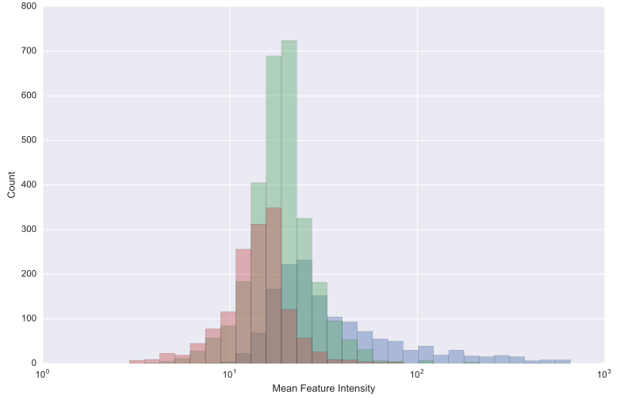
	
	:py:func:`~nPYc.plotting.histogram` - Draw a histogram, optionally segmented by a second parameter.

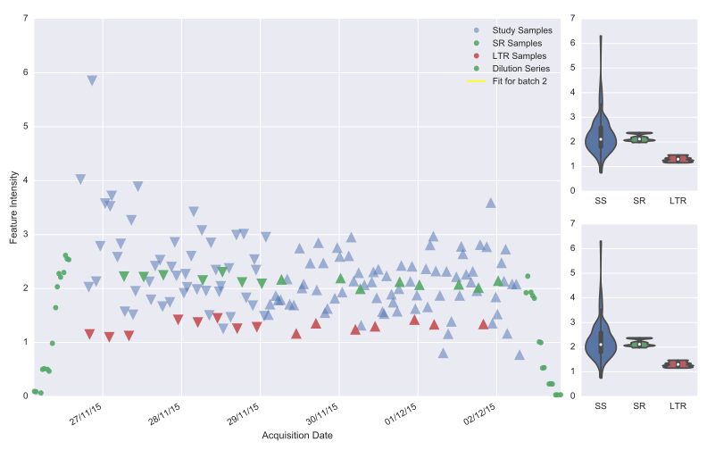
	
	:py:func:`~nPYc.plotting.plotBatchAndROCorrection` - Visualise the run-order and batch correction applied to a dataset.

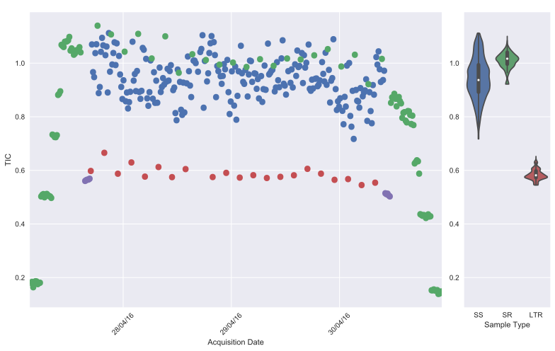
	
	:py:func:`~nPYc.plotting.plotTIC` - Visualise TIC for all or a subset of features in an :class:`~nPYc.objects.MSDataset`, coloured by class, dilution value, or detector voltage.

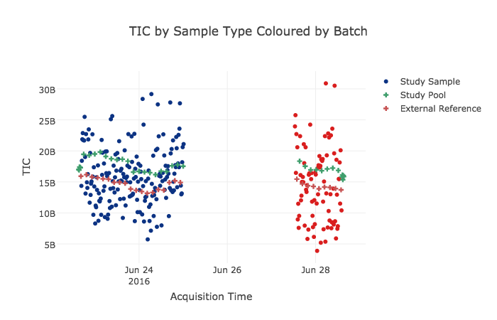
	
	:py:func:`~nPYc.plotting.plotTICinteractive` - Interactively visualise TIC vs run-order for features in an :class:`~nPYc.objects.MSDataset`, coloured by sample type.

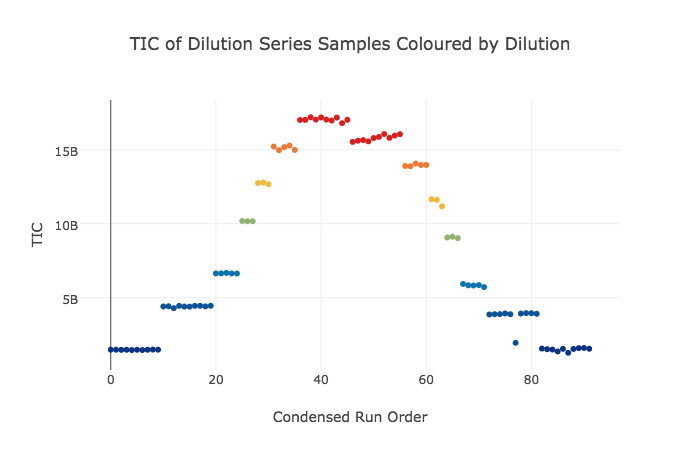
	
	:py:func:`~nPYc.plotting.plotTICinteractive` - Interactively visualise TIC vs run-order of linearity reference samples from an :class:`~nPYc.objects.MSDataset`, coloured by dilution value.

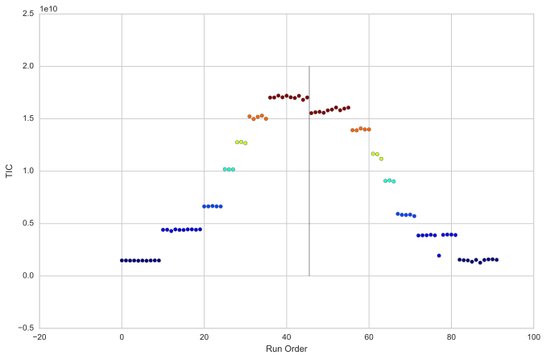
	
	:py:func:`~nPYc.plotting.plotLRTIC` - Visualise TIC vs run-order of linearity reference samples from an :class:`~nPYc.objects.MSDataset`, coloured by dilution value.

.. figure:: _static/jointplotRSDvCorrelation.svg
	:figwidth: 49%
	:alt: Visualise 2D histogram of feature RSDs vs correlations to dilution, with marginal histograms.
	
	:py:func:`~nPYc.plotting.jointplotRSDvCorrelation` - Visualise 2D histogram of feature RSDs vs correlations to dilution, with marginal histograms from :py:class:`~nPYc.enumerations.VariableType.Spectral` datasets.

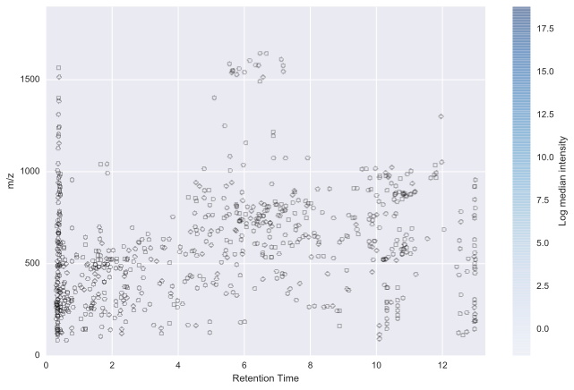
	
	:py:func:`~nPYc.plotting.plotIonMap` - Visualise the features present in an :py:class:`~nPYc.objects.MSDataset` object in terms of the original analytics. Also has a plotly-based interactive version :py:func:`~nPYc.plotting.plotIonMapInteractive`.

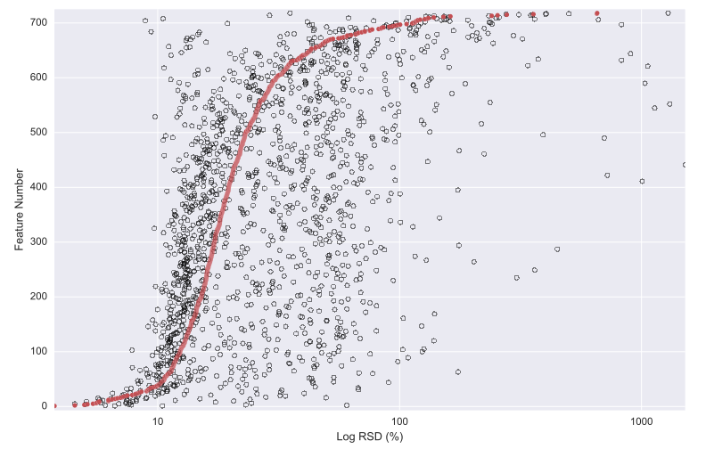
	
	:py:func:`~nPYc.plotting.plotRSDs` - Visualise the analytical and biological variance in :py:class:`~nPYc.enumerations.VariableType.Discrete`\ **ly** sampled datasets.

.. figure:: _static/plotScree.svg
	:figwidth: 49%
	:alt: Plot a barchart of variance explained (R2) and predicted (Q2) (if available) for each PCA component
	
	:py:func:`~nPYc.plotting.plotScree` - Plot a barchart of variance explained (R2) and predicted (Q2) (if available) for each PCA component derived from a PCA model generated on :class:`~nPYc.objects.Dataset` datasets.

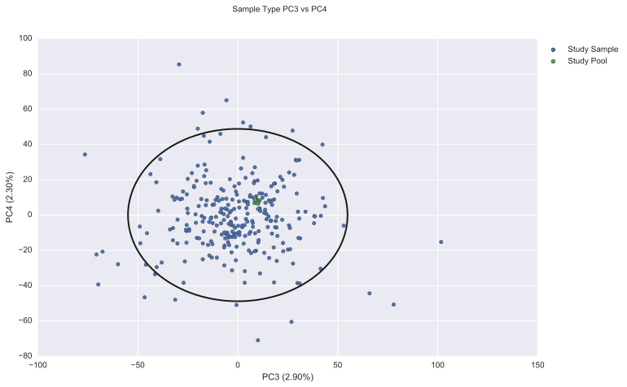
	
	:py:func:`~nPYc.plotting.plotScores` - Plot PCA scores for each pair of components in PCAmodel, coloured by values defined in classes, and with Hotelling’s T2 ellipse (95%), derived from a PCA model generated on :class:`~nPYc.objects.Dataset` datasets.

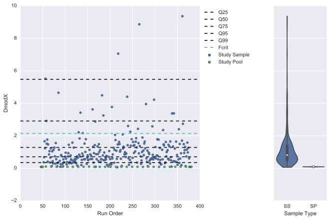
	
	:py:func:`~nPYc.plotting.plotOutliers` - Plot scatter plot of PCA outlier stats sumT (strong) or DmodX (moderate), with a line at [25, 50, 75, 95, 99] quantiles, derived from a PCA model generated on :class:`~nPYc.objects.Dataset` datasets.

.. figure:: _static/plotLoadings.svg
	:figwidth: 49%
	:alt: Plot PCA loadings for each component in PCAmodel. For NMR data plots the median spectrum coloured by the loading. For MS data plots an ion map (rt vs. mz) coloured by the loading
	
	:py:func:`~nPYc.plotting.plotLoadings` - Plot PCA loadings for each component in PCAmodel. For :class:`~nPYc.objects.NMRDataset` datasets plots the median spectrum coloured by the loading. For :class:`~nPYc.objects.MSDataset` datasets plots an ion map (rt vs. mz) coloured by the loading.
		
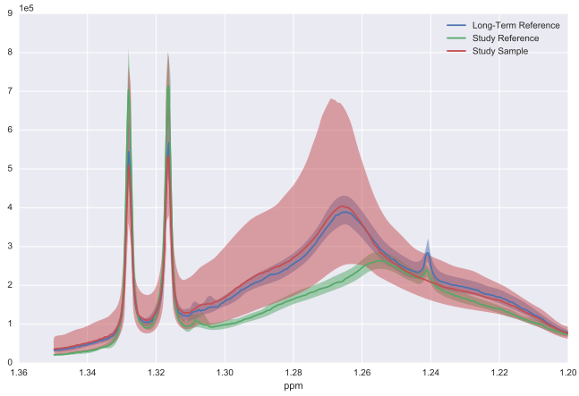
	
	:py:func:`~nPYc.plotting.plotSpectralVariance` - Plot of median profile with variance across all samples visualised in :py:class:`~nPYc.enumerations.VariableType.Spectral` datasets. Also has a plotly-based interactive version :py:func:`~nPYc.plotting.plotSpectralVarianceInteractive`.

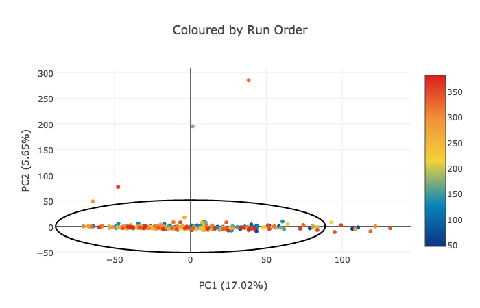
	
	:py:func:`~nPYc.plotting.plotScoresInteractive` - Interactively visualise PCA scores (coloured by a given sampleMetadata field, and for a given pair of components) with plotly, provides tooltips to allow identification of samples, derived from a PCA model generated on :class:`~nPYc.objects.Dataset` datasets.

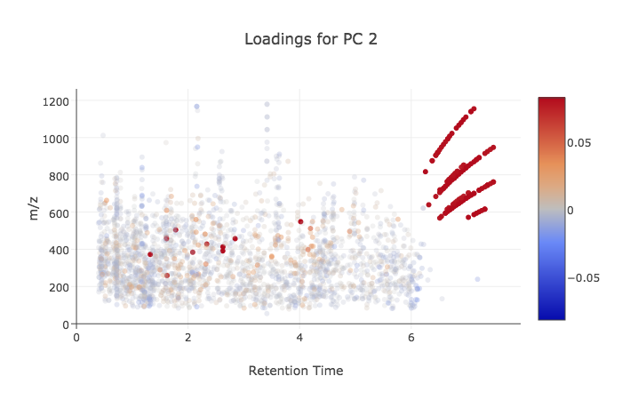
	
	:py:func:`~nPYc.plotting.plotLoadingsInteractive` - Interactively visualise PCA loadings (for a given pair of components) with plotly, provides tooltips to allow identification of features., derived from a PCA model generated on :class:`~nPYc.objects.Dataset` datasets.

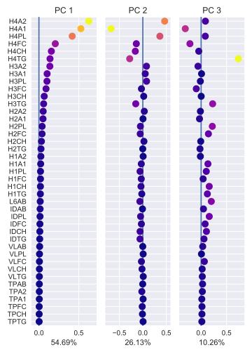
	
	:py:func:`~nPYc.plotting.plotDiscreteLoadings` - Visualise loadings of a :class:`ChemometricsPCA` model.
