Quality Assessment Reports
--------------------------

The nPYc-Toolbox offers a series of reports, pre-set visualisations comprised of text, figures and tables to describe and summarise the characteristics of the dataset, and help the user assess the overall impact of quality control decisions (e.g. whether to exclude samples or features or change filtering criteria).

The main reporting functions include:

- Sample Summary: Presents a summary of the samples acquired, see below for details
- Feature Summary: Summarises the main properties of the dataset and method specific quality control metrics, see below for details
- Multivariate Report: Summarises the main outputs of a PCA model and any potential associations with pertinent analytical metadata, see :doc:`multivariate` for full details
- Final Report: Summary report compiling information about the samples acquired, and the overall quality of the dataset
- Batch and Run-Order Correction: Specific reports for optimising and assessing correction in :py:class:`~nPYc.objects.MSDataset`, see :doc:`batchAndROCorrection` for full details
- Feature Selection: specific report for assessing the number of features passing quality criteria in :py:class:`~nPYc.objects.MSDataset`, see :doc:`masks` for full details

By default, reports are generated inline (i.e. in a Jupyter notebook), using :py:func:`~nPYc.reports.generateReport`. However reports can also be saved as html documents with static images by supplying a destination path, for example::

	saveDir = '/path to save outputs'
	nPYc.reports.generateReport(dataset, 'feature summary', destinationPath=saveDir)

The html versions of the reports use Jinja2 templates, default reports are saved in the `Templates` directory, and may be customised if required.

By default, reports are generated on the full sample and feature complement of each dataset, however, reports can also be generated on only those samples and features not set to be masked from the dataset (i.e. with sampleMask and featureMask values set to True, see :doc:`Sample and Feature Masks<objects>`), by running with *withExclusions=True* for example::

	nPYc.reports.generateReport(dataset, 'feature summary', withExclusions=True)
	
In this way, samples and features can be iteratively masked/included, and the impact of masking visualised before the masks are finally applied and samples and/or features permanently excluded from the dataset.

Throughout the reports, we reference the various QC sample types included in every dataset to enable the characterisation of data quality, see :doc:`samplemetadata` for full details.

Sample Summary Report
=====================

The sample summary report can be used to check the expected samples against those acquired, in terms of numbers, sample type, and any samples either missing from acquisition or not recorded in the sample metadata CSV file::

	nPYc.reports.generateReport(msData, 'sample summary')

The main underlying function parameters are as follows:

.. autoclass:: nPYc.reports._generateSampleReport
  :members:

Feature Summary Report: LC-MS Datasets
======================================

The LC-MS feature summary report provides visualisations summarising the quality of the dataset with regards to quality control criteria previously described in Lewis *et al* [1]_ and can be run using::

	nPYc.reports.generateReport(msData, 'feature summary')
	
The visualisations include both assessment of potential run-order and batch effects, and metrics by which feature quality can be assessed, in order, these consist of:

- Feature abundance (Figure 1)
- Sum of total ion count, TIC (Figures 2 and 3)
- Correlation to dilution (Figures 4, 5 and 7)
- Residual standard deviation, RSD (Figures 6, 7 and 9)
- Chromatographic peak width, if available (Figure 8)
- Ion map (Figure 10)

For several of these parameters (for example, correlation to dilution, RSD), acceptable default values are pre-defined in the configuration SOP, see :doc:`configuration/builtinSOPs` for details. If different values are required, these can be set by the user either by modifying the SOP, or during data import, or directly at any point during running the pipeline. For more information, see :doc:`Datasets<objects>` and for examples, :doc:`tutorial`.

The following sections describe how the quality for each of these is assessed.

**Feature abundance**

The histogram of feature abundance shows the distribution of mean abundance by sample type for each feature (Figure 1).

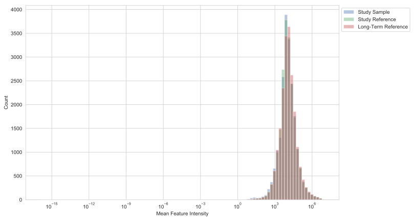
	
	Figure 1: Feature intensity histogram for all samples and all features in dataset (by sample type).

While a normal distribution is expected for the SS and SR samples, if your study includes LTR samples (QC samples from a different source to the study) it can be the case that a subset of features are not present in these samples. If this is the case, and it is required to limit the feature set to those detected in your LTR samples, features not found in this set could be excluded based on their intensity (see :doc:`masks` for details). If an unexpected distribution is observed this should be investigated, for example, by going back to XCMS feature extraction parameters.

**Sum of total ion count, TIC**

The TIC plot shows the summed intensity of all feature integrals for each sample (Figure 2) and provides insight into potential run-order and batch effects.

.. figure:: _static/featureSummaryMS_fig2_acquisitionStructure.svg
	:figwidth: 70%
	:alt: Figure 2: Sample Total Ion Count (TIC) and distribution (coloured by sample type).
	
	Figure 2: Sample Total Ion Count (TIC) and distribution (coloured by sample type).

By plotting the TIC for each sample (ordered by acquisition date) any broad trends in overall sample intensity can be observed. With LC-MS it is usual to see a gradual decline in TIC across the run owing to increasing inefficiencies in ion detection (from source and ion optic contamination), alongside large jumps if data is acquired in multiple batches, both of which can be mitigated (at least in part) by run-order and batch correction (see :doc:`batchAndROCorrection`).

With our instrumental set-up (recent generation Waters QToF instruments), we implement an automatic gain control (see Lewis *et al* [1]_). Briefly, throughout each experiment, the voltage applied to the MS detector is automatically adjusted to compensate for trends in instrument performance, which, especially when the increments in applied voltage are large, has a noticeable effect on the total ion count (TIC) of the sample. Although with our current set-up changes in detector voltage are capped and thus this is minimised, this was not always (and may not always be) the case. Therefore, an additional figure of TIC coloured by detector voltage is provided (see Figure 3 in tutorial).

**Correlation to dilution**

Correlation to dilution is one metric by which feature quality can be determined. By inclusion of a dilution series (:term:`Serial Dilution Sample`, SRD) the correlation to dilution for each feature can be calculated. A histogram of the resulting values shows the distribution of correlation to dilution (Figure 4) and a TIC plot for the SRD samples can be used to assess the overall behaviour of the dilution series (Figure 5).

A high quality dataset should contain only features that can be shown to be measured accurately with respect to the true intensity, i.e. to scale with dilution. During feature filtering, a threshold in correlation to dilution (default value 0.7) is used to exclude all features which do not respond to dilution (see :doc:`masks` for details). Figure 4 shows the distribution in correlation to dilution segmented by mean feature intensity. If the distribution in correlation to dilution values is not highly skewed to high values (especially for high and medium intensity features), the reason for this needs investigating.

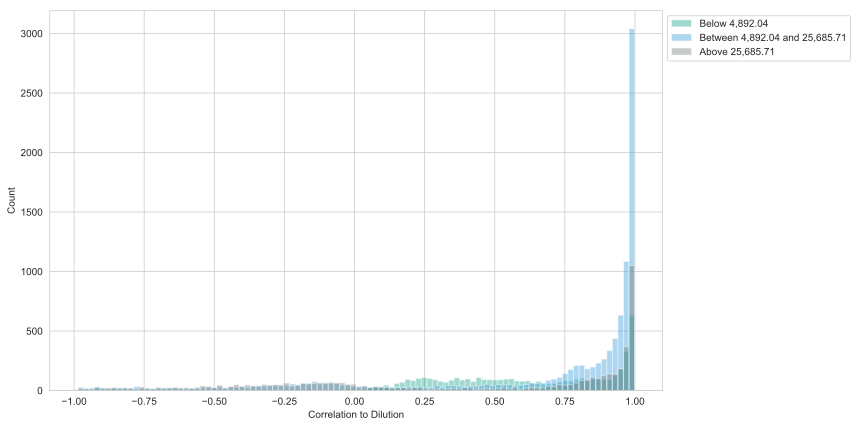
	
	Figure 4: Histogram of pearson correlation of features to serial dilution, segmented by percentile.

The first thing to check in this case is that the overall trend in TIC for the dilution series samples corresponds to the expected dilution as defined in the 'Basic CSV' file (see :doc:`CSV template for metadata import<samplemetadata>`), this is shown in Figure 5. Any outliers (for example, mis-injections) can be excluded, which may have a substantial impact on the resulting correlation values.

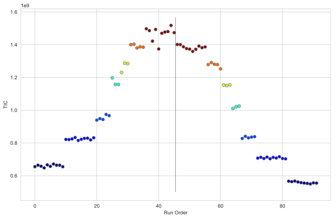
	
	Figure 5: TIC of serial dilution (SRD) samples coloured by sample dilution.

If a large number of SRD samples are not scaling with dilution, and the distribution in correlation values is poor, the cause of this should be investigated across all stages, from acquisition, through conversion and peak detection.

**Residual standard deviation, RSD**

Another key metric by which feature quality can be assessed is that of residual standard deviation (:term:`Relative Standard Deviation`, RSD). By inclusion of precision reference samples (:term:`Study Reference`, SR) or :term:`Long-Term Reference`, LTR) the RSD for each feature can be calculated. A histogram of the resulting values shows the distribution of RSD in the SR samples (Figure 6) and a plot of the RSD for each feature by sample type (Figure 9) allows comparison of the variation observed between QC and study samples.

A high quality dataset should contain only features that can be shown to be measured precisely from multiple acquisitions across the run (in this case this is provided by repeated injections of the pooled SR sample). During feature filtering a threshold in RSD (default value 30) is used to exclude all features which cannot be measured precisely across the run (see :doc:`masks` for details). Figure 6 shows the distribution in RSD segmented by mean feature intensity. If the distribution is not skewed to low values (especially for high and medium intensity features), the reason for this needs investigating.

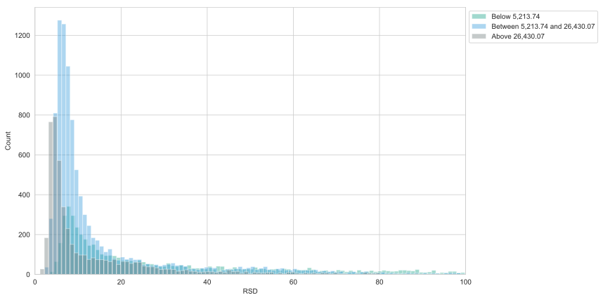
	
	Figure 6: Histogram of Residual Standard Deviation (RSD) in study reference (SR) samples, segmented by abundance percentiles.

The first thing to check is substantial run-order and batch trends (Figure 2), if these are present, the RSD in the SR samples will be skewed to higher values, and batch and run-order correction should be first applied. Additionally, outlying SR samples can cause inflation to the RSD, if a small number of SR samples demonstrate an unusual TIC (which is not shown by surrounding SS samples) these should be excluded before RSD is calculated.

In addition to the requirement that features are measured precisely, the variance observed in the study samples, should exceed that measured in the SR samples, with the expectation that biological variance should exceed analytical variance. The plot comparing the RSD measured in the different sample classes (study reference sample, study samples etc.) provides insight into variance structures in the dataset (Figure 9).

.. figure:: _static/featureSummaryMS_fig9_RSDdistributionFigure.svg
	:figwidth: 70%
	:alt: Figure 9: RSD distribution for all samples and all features in dataset (by sample type).
	
	Figure 9: RSD distribution for all samples and all features in dataset (by sample type).

Finally, to assess the main feature quality metrics together a plot of RSD vs. correlation is provided (see Figure 7 in tutorial).

**Chromatographic peak width**

If available, a histogram is plotted of chromatographic peak width (if available, Figure 8).

Narrower peaks mean better chromatographic resolution, while broadening in peak width (when compared with previous runs) imply indicate potential aging of the column, which may need replacing.

**Ion map**

The ion map visualises the location of the detected features in the m/z and retention time space of the assay (Figure 10).

.. figure:: _static/featureSummaryMS_fig10_ionMap.svg
	:figwidth: 70%
	:alt: Figure 10: Ion map of all features (coloured by log median intensity).
	
	Figure 10: Ion map of all features (coloured by log median intensity).

This plot can be used to assess potential feature exclusion ranges. For example, where the retention time is outside the useful range of the assay, or presence of signals resulting from polymer contamination.

  
Feature Summary Report: NMR Datasets
====================================

The NMR feature summary report provides visualisations summarising the quality of the dataset with regards to quality control criteria previously described in Dona *et al* [#]_ and can be run using::

	nPYc.reports.generateReport(nmrData, 'feature summary')

The visualisations include various metrics by which dataset quality can be assessed, in order, these consist of:

- Chemical shift calibration (Figure 1)
- Line width (Figures 2 and 3)
- Baseline consistency (Figure 4)
- Quality of solvent suppression (Figure 5)

For several of these parameters (for example, line width), acceptable default values are pre-defined in the configuration SOP, see :doc:`configuration/builtinSOPs` for details. If different values are required, these can be set by the user either by modifying the SOP, or during data import, or directly at any point during running the pipeline. For more information, see :doc:`Datasets<objects>` and for examples, :doc:`tutorial`.

Any samples failing any of the above criteria are flagged, but in the appropriate plots, and in the table at the end of the report.

The following sections describe how the quality for each of these is assessed.

**Chemical shift calibration**

Variations in sample temperature between acquisitions can result in minor deviations in the chemical shift scale between spectra. To correct these shifts, the toolbox uses an adaptation of the technique published in Pearce *et al* [#]_.

Subsequently, the chemical shift calibration algorithm detects deviation from the expected delta ppm and flags those samples outside of the empirical 95% bound as estimated from the whole dataset (Figure 1).

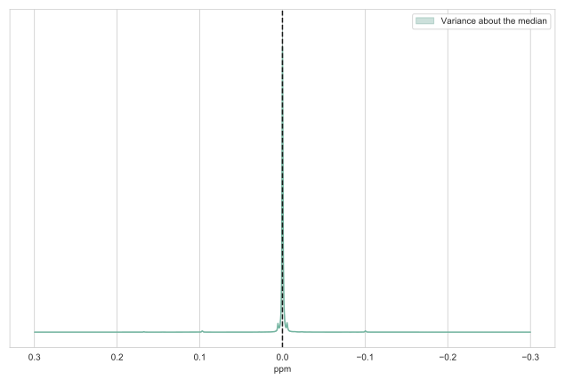
	
	Figure 1: Distribution of all samples after chemical shift calibration (5-95% with outliers flagged).

If spectra are failing calibration, firstly the presence of the target resonance should be checked, and if required, a different peak target can be defined as described above. 

**Line width**

Spectral line-width is calculated by fitting a pseudo-voigt line shape to a pre-specified signal on the native-resolution Fourier-transformed spectrum at import, using the *lmfit* module ( [#]_) to optimise the fit.

In the default configuration of the toolbox, line-width is calculated by fitting the TSP singlet at (ppm=0) in urine spectra, and the lactate quartet at (ppm=4.11) in serum or plasma.

A box plot of the calculated line width values coloured by sample type is plotted in Figure 2.

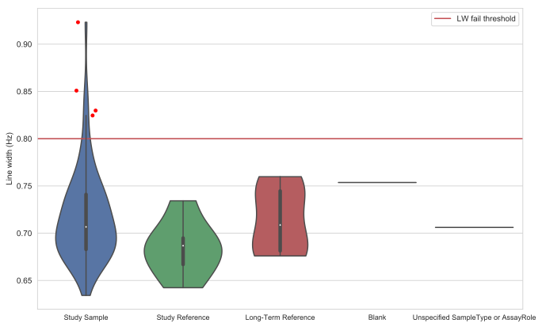
	
	Figure 2: Boxplot of line width values (coloured by sample type).
	
Any samples with values above the line width threshold (here set to 0.8 as above), are also plotted (Figure 3)

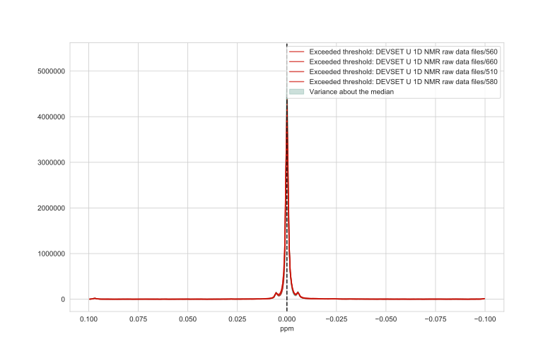
	
	Figure 3: Distribution of all samples around peak on which line width calculated (5-95% with outliers flagged).

Depending on the number of samples failing the line width checks, either individual samples may be re-run, or, if necessary, the acquisition parameters adjusted by the spectroscopist.

**Baseline consistency**

Baseline consistency is calculated based on two regions at either end of the spectrum expected to contain only electronic noise. For these regions the 5% and 95% percentile bounds in intensity are calculated using all the points in all the spectra. For each individual spectrum, if more than 95% of the intensity points fall outside of these bounds the sample is flagged for review (Figure 4).

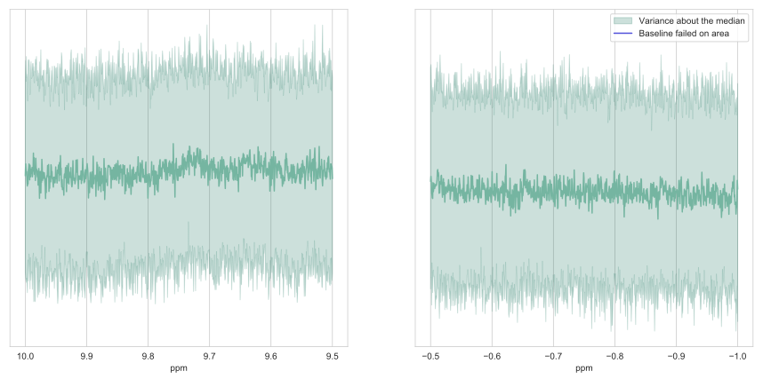
	
	Figure 4: Distribution of all samples at baseline regions (5-95% with outliers flagged).

The phasing of spectra flagged for review should first be checked, and adjusted if applicable. If a larger number of samples in the dataset fail the spectrometer acquisition parameters (such as receiver gain settings) and sample preparation (such as dilution) should be revised.

**Quality of solvent suppression**

The solvent suppression quality control is performed by applying the same method as above to the regions flanking either side of the residual solvent peak (Figure 5).

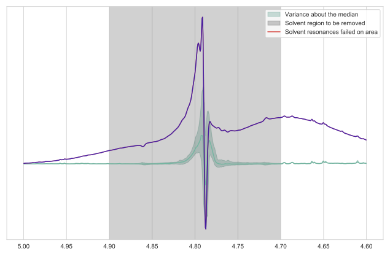
	
	Figure 5: Distribution of all samples at region surrounding solvent suppression peak (5-95% with outliers flagged).

This test normally flags very dilute samples for which it might be difficult to obtain a high quality spectrum without adjusting the sample preparation. However, for these spectra, re-acquisition with more manual adjustment of the solvent suppression parameters may substantially improve the data.

Feature Summary Report: NMR Targeted Datasets
=============================================

The feature summary report provides visualisations summarising the quality and distribution of values across samples for each individual feature. This report can be obtained by running::

	nPYc.reports.generateReport(TargetedData, 'feature summary')

In order, for an NMR targeted dataset these consist of:

- Summary of quantification parameters (Table 1)
- Residual standard deviation, RSD (Figure 2, Table 2)
- Feature distributions (Figure 3)

**Summary of quantification parameters**

The initial set of tables in the targeted feature summary report summarise information about each of the quantified features (including quantification parameters and reference ranges if available). The first table gives overall results, and in subsequent tables the features and results are broken down by the quantification type.

Depending on the data generation process, the confidence in quantified values can vary greatly, ranging from semi-quantitative measurements (where area is reported but not concentration) to quantitative values (where absolute concentrations are reported) (Broadhurst *et al* [#]_). 

The *QuantificationType* field describes the rigour of the quantification of each compound, see :doc:`class nPYc.enumerations.QuantificationType<enumerations>` for all available options. In Bruker NMR Targeted methods, compounds are quantified using a quantitative method that does not rely on internal standards, therefore 'QuantOther' is the recorded value.

Similarly, as a variety of calibration methods can be employed, the *CalibrationMethod* defines how the calibration curve and spiked standards interact to establish a quantitative measurement, see :doc:`class nPYc.enumerations.CalibrationMethod<enumerations>` for all available options. In Bruker NMR Targeted methods, a quantitative approach that does not rely on calibration curves and internal standard is utilised, therefore 'otherCalibration' is the recorded value.

For a given analytical platform, each compound will have a range at which its concentration can be satisfactorily determined; outside of which range the reported value could substantially differ from the true sample concentration (Synovec *et al* [#]_).
The definition of what is “satisfactory” and how this range (sometimes called linear range) is determined is specific to the analytical platform and common guidelines set by the community and regulatory agencies (Lee *et al* [#]_).

Depending on the quantification method employed, there are several different quantification measures that may be reported. The LLOQ (lowest limit of quantification) and ULOQ (upper limit of quantification) are the lowest and highest concentration values respectively between which quantitative results can be obtained with a specific degree of confidence. When reporting quantitative data, current convention impose to report values inferior to the LLOQ as "<LLOQ" and values superior to the ULOQ as ">ULOQ". Data extrapolated outside of these limits are typically not reported in published results as they do not satisfy a predefined degree of confidence

Alternatively, limits of detection (LOD) are sometimes reported, as is the case for the Bruker NMR Targeted outputs.

**Residual standard deviation, RSD**

As for the MS profiling datasets, for targeted datasets :term:`Relative Standard Deviation` can be calculated for each feature, and on each sample type (Figure 2, Table 2).

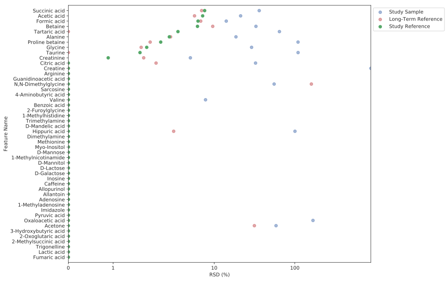

	Figure 2: Distribution of values for each feature per sample type.

Figure 2 allows a comparative visualization of the RSD per feature across each Sample Type.

A high quality dataset should contain only features that can be shown to be measured precisely from multiple acquisitions across the run (in this case this is provided by repeated injections of the pooled SR sample). Subsequently, at the feature filtering stage a threshold in RSD (default value 30) is used to exclude all features that cannot be measured precisely across the run. 

From both Figure 2 and Table 2 it can be seen that for this dataset there are many features with zero values across all samples (and thus also an RSD of zero), these features can also be removed from the dataset if required.

**Feature distributions**

Finally, violin plots giving the distribution in intensity for each measured feature and for each sample type are shown in Figure 3.

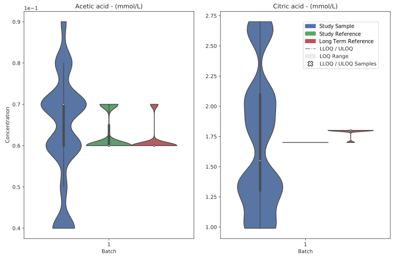

	Figure 3: Distribution of values for each feature per sample type.

These can also be used to identify features with a very high proportion of zeros or values outside the limits of quantification.

Dataset Specific Reporting Syntax and Parameters
================================================

The main function parameters (which may be of interest to advanced users) are as follows:

.. autoclass:: nPYc.reports._generateReportMS
  :members:
  
.. autoclass:: nPYc.reports._generateReportNMR
  :members:
	
.. autoclass:: nPYc.reports._generateReportTargeted
  :members:
  
  
.. [1] Matthew R Lewis, Jake TM Pearce, Konstantina Spagou, Martin Green, Anthony C Dona, Ada HY Yuen, Mark David, David J Berry, Katie Chappell, Verena Horneffer-van der Sluis, Rachel Shaw, Simon Lovestone, Paul Elliott, John Shockcor, John C Lindon, Olivier Cloarec, Zoltan Takats, Elaine Holmes and Jeremy K Nicholson. Development and Application of Ultra-Performance Liquid Chromatography-TOF MS for Precision Large Scale Urinary Metabolic Phenotyping. Analytical Chemistry, 88(18):9004-9013, 2016. URL: http://dx.doi.org/10.1021/acs.analchem.6b01481

.. [#] Anthony C Dona, Beatriz Jiménez, Hartmut Schäfer, Eberhard Humpfer, Manfred Spraul, Matthew R Lewis, Jake TM Pearce, Elaine Holmes, John C Lindon and Jeremy K Nicholson. Precision High-Throughput Proton NMR Spectroscopy of Human Urine, Serum, and Plasma for Large-Scale Metabolic Phenotyping. Analytical Chemistry, 86(19):9887-9894, 2014. URL: http://dx.doi.org/10.1021/ac5025039

.. [#] Jake TM Pearce, Toby J Athersuch, Timothy MD Ebbels, John C Lindon, Jeremy K Nicholson and Hector C Keun. Robust Algorithms for Automated Chemical Shift Calibration of 1D 1H NMR Spectra of Blood Serum. Analytical Chemistry, 80(18):7158-62, 2008. URL: http://dx.doi.org/10.1021/ac8011494

.. [#] Matt Newville, Renee Otten, Andrew Nelson, Antonino Ingargiola, Till Stensitzki, Dan Allan, Austin Fox, Michał, Glenn, Yoav Ram, MerlinSmiles, Li Li, Christoph Deil, Stuermer, Alexandre Beelen, Oliver Frost, gpasquev, Allan L. R. Hansen, Alexander Stark, Tim Spillane, Shane Caldwell, Anthony Polloreno, Nicholas Earl, colgan, Robbie Clarken, Kostis Anagnostopoulos, Jose Borreguero, deep-42-thought, Ben Gamari and Anthony Almarza. lmfit. 2018. URL: https://doi.org/10.5281/zenodo.1249416

.. [#] David Broadhurst, Royston Goodacre, Stacey N Reinke, Julia Kuligowski, Ian D Wilson, Matthew R Lewis and Warwick B Dunn. Guidelines and considerations for the use of system suitability and quality control samples in mass spectrometry assays applied in untargeted clinical metabolomic studies. Metabolomics, 14(6):72, 2018. URL: https://doi.org/10.1007/s11306-018-1367-3

.. [#] Synovec, Robert E and Yeung, Edward S. Improvement of the Limit of Detection in Chromatography by an Integration Method. Analytical Chemistry, 57(12):2162-2167, 1985. URL: https://doi.org/10.1021/ac00289a001

.. [#] Jean W Lee, Viswanath Devanarayan, Yu Chen Barrett, Russell Weiner, John Allinson, Scott Fountain, Stephen Keller, Ira Weinryb, Marie Green, Larry Duan, James A Rogers, Robert Millham, Peter J O'Brien, Jeff Sailstad, Masood Khan, Chad Ray and John A Wagner. Fit-for-purpose method development and validation for successful biomarker measurement. Pharmaceutical Research, 23(2):312-28, 2006. URL: http://dx.doi.org/10.1007/s11095-005-9045-3

