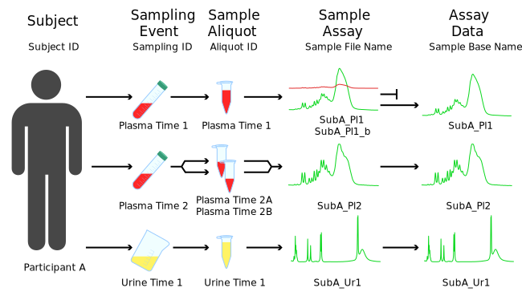

Adding Sample Metadata
----------------------

Additional study design parameters or sample metadata may be mapped into the Dataset using the addSampleInfo() method. For the purpose of standardising QC filtering procedures, the nPYc toolbox defines a small set of terms for describing reference sample types and design elements.

Sample and study design nomenclature
====================================

The :mod:`nPYc` toolbox uses the following nomenclature when defining sample types and analytical study design elements. Certain terms are defined and controlled in the :mod:`~nPYc.enumerations` module.

	
	Generation of samples
	 
The hierarchy of sample generation, :term:`Study samples<study sample>` are generated from :term:`participants<participant>` at one or more :term:`sampling events<sampling event>`. These sample are then :term:`assayed<assay>` by one or more methods, generating a :term:`unique<Sample Base Name>` dataset for each :term:`sample assay`.
	
In order to estimate analytical quality in a robust and extensible fashion, the nPYc-Toolbox characterises the samples constituting a study by two parameters; the sample type, i.e., the source and composition of the sample, and the assay role, the rational for a specific acquisition of data.
	
Sample Types are described in detail here :py:class:`~nPYc.enumerations.SampleType`, the most common are:

- 'Study Sample' comprise the study in question
- 'Study Pool' a mixture made from pooling all/some study samples
- 'External Reference' a sample of a comparable matrix to the study samples, but not derived from samples acquired as part of the study
	
Assay Roles are described in detail here :py:class:`~nPYc.enumerations.AssayRole`, the most common are:

- 'Assay' form the core of an analysis
- 'Precision Reference' acquired to characterise analytical variability
- 'Linearity Reference' samples used assess the linearity of response (intenity response to changes in abundance) in the dataset

Common combinations of *Sample Type* and *Assay Role* are defined within the nPYc-Toolbox and used to characterise data quality, these include:

- :term:`Study Reference` (SR): A *Study Pool*, *Precision Reference* combination used to assess analytical stability across the aquisition run
- :term:`Long-Term Reference` (LTR): An *External Reference*, *Precision Reference* combination used to assess analytical stability across the aquisition run, and furthermore between different studies
- :term:`Serial Dilution Sample` (SRDS): A *Study Pool*, *Linearity Reference* combination used to assess linearity of response, often by repeated injection at varying concentrations or levels of dilution. If generated by dilution from a base level, the percentage concentration of each SRDS is indicated in the ’Dilution’ field of the sampleMetadata table
	

CSV template for metadata import
================================

The ‘Basic CSV’ format specifies a simple method for matching analytical data to metadata. Although optional, it is recommend to generate such a CSV file containing basic metadata about each of the imported spectra. 

The nPYc-Toolbox options contains a default syntax for adding sample metadata in a predefined CSV format.

In brief, this CSV file format expects information to be provided for 6 pre-defined column names, ‘Sample File Name’, ‘Sample ID’, ‘SampleType’, ‘AssayRole’, ‘Dilution’, ‘Include Sample’. Any extra metadata (such as patient characteristics or clinical metadata) can be placed in this file, as long as the column names are not in the list of expected fields.

- 'Sample ID': Unique identifier for each sample
- 'Sample File Name': the 'Basic CSV' file matches based on the entries in the 'Sample File Name' column to the 'Sample File Name' in the :py:attr:`~nPYc.objects.Dataset.sampleMetadata` table
- 'AssayRole': :term:`assay role<assay role>` as described above
- 'SampleType': :term:`sample type<sample type>` as described above
- 'Dilution': Relative dilution factor for each sample
- 'Include Sample': where 'Include Sample' is ``False``, the :py:attr:`~nPYc.objects.Dataset.sampleMask` for that sample will be set to ``False`` and the corresponding sample marked for exclusion from the dataset

.. table:: Minimal structure of a basic csv file
   :widths: auto
   
   =========== ============================== =================== ================== ======== ==============
   Sample ID   Sample File Name               AssayRole           SampleType         Dilution Include Sample
   =========== ============================== =================== ================== ======== ==============
   Dilution 1  UnitTest1_LPOS_ToF02_B1SRD01   Linearity Reference Study Pool         1        TRUE
   Dilution 2  UnitTest1_LPOS_ToF02_B1SRD02   Linearity Reference Study Pool         50       TRUE
   Sample 1    UnitTest1_LPOS_ToF02_S1W07     Assay               Study Sample       100      TRUE
   Sample 2    UnitTest1_LPOS_ToF02_S1W08_x   Assay               Study Sample       100      TRUE
   LTR         UnitTest1_LPOS_ToF02_S1W11_LTR Precision Reference External Reference 100      TRUE
   SR          UnitTest1_LPOS_ToF02_S1W12_SR  Precision Reference Study Pool         100      TRUE
   Sample 3    UnitTest1_LPOS_ToF02_S1W09_x   Assay               Study Sample       100      FALSE
   Blank 1     UnitTest1_LPOS_ToF02_Blank01   Assay               Procedural Blank   0        TRUE
   =========== ============================== =================== ================== ======== ==============

Any additional columns in the basic csv file will be appended to the :py:attr:`~nPYc.objects.Dataset.sampleMetadata` table as additional sample metadata.

Analytical Parameter Extraction
===============================

With the nPYc-Toolbox it is possible to extract parameters directly from raw data files (currently for Bruker and Waters .RAW data only).

.. automodule:: nPYc.utilities.extractParams
   :members:
   :exclude-members: buildFileList, extractWatersRAWParams, extractBrukerparams